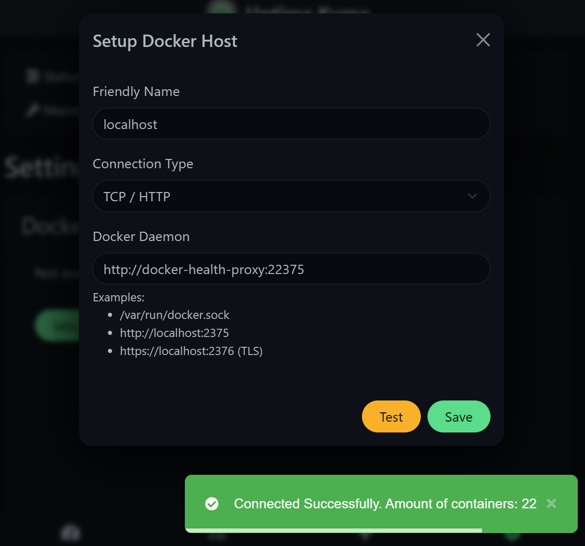
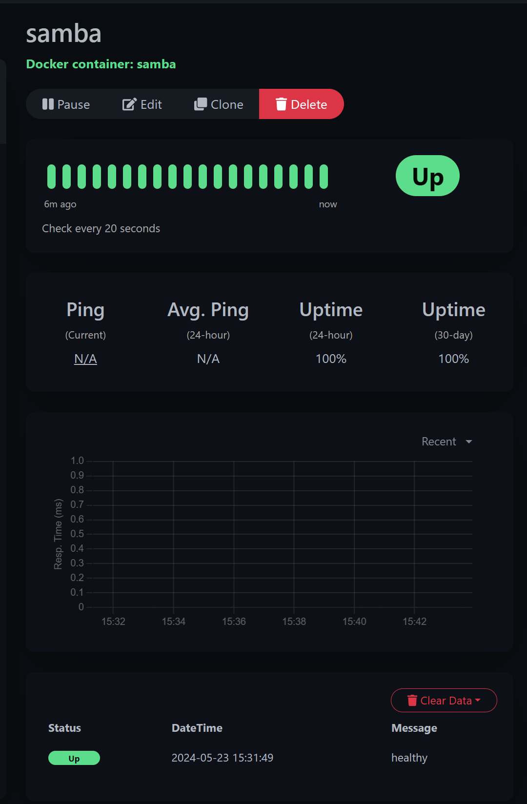

# docker-health-proxy

Make container status and health information available - but nothing else.

This is specifically setup for [Uptime Kuma](https://github.com/louislam/uptime-kuma)
but might be useful for other projects wanting to monitor docker containers
without exposing the full docker API or sensitive container details.

## Available APIs

Except for the two APIs below, access is denied to all other API calls. APIs may be prefixed with a version, e.g. `/v1.45/_ping`.

### GET /_ping

[official docs](https://docs.docker.com/engine/api/v1.45/#tag/System/operation/SystemPing)

Use this to check if the docker daemon is alive. On success, it returns
status 200 and `OK`. Otherwise, expect a 5xx error.

### GET /containers/{name}/json

[official docs](https://docs.docker.com/engine/api/v1.45/#tag/Container/operation/ContainerInspect)

Inspect the state of a running container. Note that the information returned
is fully redacted. The typical output for a container with health checks is thus:

```json
{
    "State": {
        "Status": "running",
        "Running": true,
        "Health": {
            "Status": "healthy"
        }
    }
}
```

If the container doesn't exist, you get a 404 error with a JSON
response similar to `{"message":"No such container: tango"}`.

## Running from the command line

As you're here to monitor docker containers, I suppose you have an understanding
how [Docker networking](https://docs.docker.com/network/) needs to be setup.

If your docker socket is exposed over the network, you will need to pass the
`NGINX_DOCKER_HOST` environment variable. For port 2375 on your host,
you probably want something like `localhost:2375` or
`host.docker.internal:2375`, depending on your actual setup, both
without the `http://` prefix or a trailing `/`.

**NOTE: everyone able to connect to this port has full root access to your system.**

```sh
$ sudo docker run -d --net=host -e NGINX_DOCKER_HOST=localhost:2375 \
                  ghcr.io/thielj/docker-health-proxy:latest

# -- or --

$ sudo docker run -d -e NGINX_DOCKER_HOST=host.docker.internal:2375` \
                  --add-host=host.docker.internal:host-gateway \
                  ghcr.io/thielj/docker-health-proxy:latest
```

The other option is to mount the docker socket into the container.
Your host's docker installation is probably similar to mine below, giving
access to `root` and every member of the `docker` group:

```sh
$ ls -l /var/run/docker.sock
srw-rw---- 1 root docker 0 May 21 13:39 /var/run/docker.sock

$ ls -ln /var/run/docker.sock
srw-rw---- 1    0    994 0 May 21 13:39 /var/run/docker.sock

$ getent group docker
docker:x:994:
```

**Please note that the `docker` GID varies. Mine is 994. You need to
substitute that number with yours everywhere below.**

The container is already setup to be run as UID=1000. To give it access to
the mounted socket, you can either add this user to your `docker` group
(`adduser $(id -nu 1000) docker`, not reccommended) or run the container
with the `docker` GID set like this:

```sh
$ sudo docker run -d -v "/var/run/docker.sock:/var/run/docker.sock:ro" \
                  -u 1000:994 ghcr.io/thielj/docker-health-proxy:latest
```

## Test It!

Assuming your container is named 'docker-health-proxy', you can do the following to get its IP address and test it out:

```sh
$ sudo docker inspect docker-health-proxy | grep IPAddress
            "SecondaryIPAddresses": null,
              "IPAddress": "",
                    "IPAddress": "172.25.7.28",

$ curl http://172.25.7.28:22375/_ping
OK

$ curl http://172.25.7.28:22375/containers/docker-health-proxy/json
{"State":{"Running":true,"Status":"running"}}

$ docker -H tcp://172.25.7.28:22375 inspect docker-health-proxy
[
    {
        "State": {
            "Running": true,
            "Status": "running"
        }
    }
]
```

Note that the last docker command is using the proxy and doesn't require `sudo` or any special permissions.

## Environment variables

The following variables are used:

| Name              | Default                   | Alternative         |
| ----------------- | ------------------------- | ------------------- |
| NGINX_DOCKER_HOST | unix:/var/run/docker.sock | hostname.or.ip:port |
| NGINX_LISTEN      | 22375                     |                     |

## Docker Compose Example

You have to replace `${DOCKER_GID}` with the `docker` GID as described above,
or run `DOCKER_GID=994 sudo docker compose up -d` or supply that variable
through the enviroment in another way.

```yaml
# NOTE: This is a minimalist example. You probably want to make changes
#       to the setup for actual use.

services:

  docker-health-proxy:
    image: ghcr.io/thielj/docker-health-proxy:latest
    user: 1000:${DOCKER_GID}
    volumes: [ "/var/run/docker.sock:/var/run/docker.sock:ro" ]
    #extra_hosts: [ "host.docker.internal:host-gateway" ]
    #environment:
      #NGINX_DOCKER_HOST: 'host.docker.internal:2375'
      #NGINX_LISTEN: 22375
    #ports: [ "22375:22375" ]

  uptime-kuma:
    image: louislam/uptime-kuma
    links: [ docker-health-proxy ]
    volumes: [ /app/data ]
    ports: [ "3001:3001" ]
```

## Uptime Kuma Setup

You can now open Uptime Kuma and change the docker settings to use
`http://docker-health-proxy:22375`.



## Happy Monitoring!

